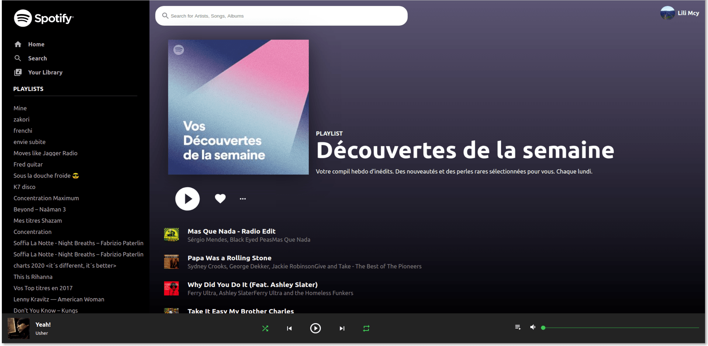

[App Live Demo](https://jovial-mccarthy-6875cf.netlify.app)

➡ [Project Roadmap](https://github.com/boostup/react-spotify-clone-app/wiki/Roadmap)

➡ [Project Technical Characteristics](https://github.com/boostup/react-spotify-clone-app/wiki/Project-Technical-Characteristics)

➡ [What I've learned](https://github.com/boostup/react-spotify-clone-app/wiki/What-I've-learned)

<a href="https://jovial-mccarthy-6875cf.netlify.app" target="_blank">
    
</a>

# About

This project was created with [Create React App](https://github.com/facebook/create-react-app).

However, it is now bootstrapped by netlify cli.

Meaning that running one command (`netlify dev`) will start both:

- the backend (`netlify functions` living inside the `[root]/backend/` directory)
- the frontend (a `create-react-app` app living inside the `[root]/src/` directory)

This means that both backend AND frontend logs will print within the same console. No need to open a separate terminal windows for each, which is great !

This project can be locally ran on your dev machine.

Here's how :

- clone this repository on your local machine
- from the root directory, run the following commands in the terminal:

```
- yarn
- netlify login
- netlify status
- netlify link
    - Choose option: `use current git remote origin (https://github.com/boostup/react-spotify-clone-app)`
- netlify dev
```

## Troubleshooting

### [WSL only] After running the `netlify dev` command, if you see this error in the terminal:

`Error: Unable to open browser automatically: Command failed: wslpath \System32\WindowsPowerShell\v1.0\powershell.exe wslpath: \System32\WindowsPowerShell\v1.0\powershell.exe`

- restart the terminal (by closing it and opening it again for example).
- run `netlify dev` again
- the message should no longer appear, as it actually managed to open the browser window which failed previously

### Local Environment Variables

- create a file called exactly: `.env.development`
- grab all variables stored in netlify
- replace all instances of `jovial-mccarthy-6875cf.netlify.app` with `localhost:8888`
- save the file at root directory level (so same level as other directories such as `src` or `backend`)
- run `netlify dev`
- `◈ Injected .env.development file env var: APP_DOMAIN` for example will confirm that it work, as it would otherwise show:
  `◈ Injected build setting env var: APP_DOMAIN`
  => pay attention to the difference : `Injected .env.development` vs `Injected build` portions

---

# Getting Started with Create React App

This project was bootstrapped with [Create React App](https://github.com/facebook/create-react-app).

## Available Scripts

In the project directory, you can run:

### `yarn start`

Runs the app in the development mode.\
Open [http://localhost:3000](http://localhost:3000) to view it in the browser.

The page will reload if you make edits.\
You will also see any lint errors in the console.

### `yarn test`

Launches the test runner in the interactive watch mode.\
See the section about [running tests](https://facebook.github.io/create-react-app/docs/running-tests) for more information.

### `yarn build`

Builds the app for production to the `build` folder.\
It correctly bundles React in production mode and optimizes the build for the best performance.

The build is minified and the filenames include the hashes.\
Your app is ready to be deployed!

See the section about [deployment](https://facebook.github.io/create-react-app/docs/deployment) for more information.

### `yarn eject`

**Note: this is a one-way operation. Once you `eject`, you can’t go back!**

If you aren’t satisfied with the build tool and configuration choices, you can `eject` at any time. This command will remove the single build dependency from your project.

Instead, it will copy all the configuration files and the transitive dependencies (webpack, Babel, ESLint, etc) right into your project so you have full control over them. All of the commands except `eject` will still work, but they will point to the copied scripts so you can tweak them. At this point you’re on your own.

You don’t have to ever use `eject`. The curated feature set is suitable for small and middle deployments, and you shouldn’t feel obligated to use this feature. However we understand that this tool wouldn’t be useful if you couldn’t customize it when you are ready for it.

## Learn More

You can learn more in the [Create React App documentation](https://facebook.github.io/create-react-app/docs/getting-started).

To learn React, check out the [React documentation](https://reactjs.org/).

### Code Splitting

This section has moved here: [https://facebook.github.io/create-react-app/docs/code-splitting](https://facebook.github.io/create-react-app/docs/code-splitting)

### Analyzing the Bundle Size

This section has moved here: [https://facebook.github.io/create-react-app/docs/analyzing-the-bundle-size](https://facebook.github.io/create-react-app/docs/analyzing-the-bundle-size)

### Making a Progressive Web App

This section has moved here: [https://facebook.github.io/create-react-app/docs/making-a-progressive-web-app](https://facebook.github.io/create-react-app/docs/making-a-progressive-web-app)

### Advanced Configuration

This section has moved here: [https://facebook.github.io/create-react-app/docs/advanced-configuration](https://facebook.github.io/create-react-app/docs/advanced-configuration)

### Deployment

This section has moved here: [https://facebook.github.io/create-react-app/docs/deployment](https://facebook.github.io/create-react-app/docs/deployment)

### `yarn build` fails to minify

This section has moved here: [https://facebook.github.io/create-react-app/docs/troubleshooting#npm-run-build-fails-to-minify](https://facebook.github.io/create-react-app/docs/troubleshooting#npm-run-build-fails-to-minify)
